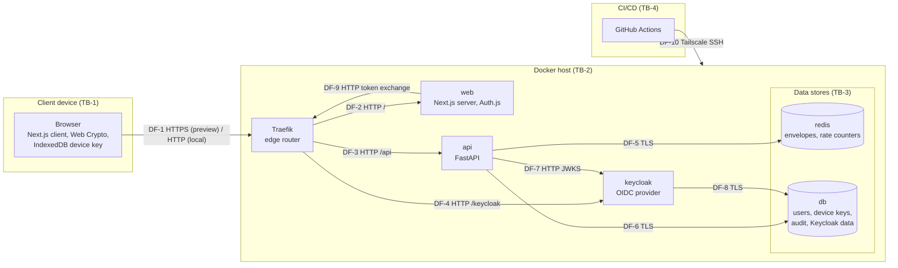

# Threat model

This document identifies what SecretShare protects, where trust changes between
components, who may attack the system, and which threats apply to each component.
Each threat is linked to the controls that address it and to the risk that
remains in `risk-register.md`.

State assessed: branch `main`, commit `2b98875`, 23 September 2026.

---

## 1. Method

1. The system was decomposed into components and data flows (section 3).
2. Assets were listed with the security property that matters most for each
   (section 4).
3. Trust boundaries were placed wherever data crosses from one level of trust to
   another (section 5).
4. Threat actors were derived from the domain analysis of the internship report,
   table 1.1, and extended with actors from the infrastructure (section 6).
5. Threats were enumerated per component with STRIDE: Spoofing, Tampering,
   Repudiation, Information disclosure, Denial of service, Elevation of privilege
   (section 8).
6. Each threat was mapped to existing controls and, where a gap remains, to a risk
   in `risk-register.md`, where it is rated and assigned a treatment.

The model is reviewed when a component, data flow or trust boundary changes, and at
least once per PBL milestone.

## 2. System summary

A sender addresses a secret to a Keycloak user name. The API does not require the
sender to be signed in (see T-04). The sender's browser fetches the recipient's device public keys, encrypts the secret with
AES-256-GCM, wraps the content key with RSA-OAEP for each device and sends the
envelope to the API. The API stores the envelope in Redis with a time to live and
returns a 256-bit payload identifier. The recipient opens the share link, the
browser checks that the secret exists without consuming it, and after
confirmation and sign-in the API releases the envelope to the recipient and
deletes it in one atomic step. The recipient's browser decrypts it locally.

## 3. Components and data flows

| Flow | From → To | Content | Protection |
|---|---|---|---|
| DF-1 | Browser → Traefik | Pages, API calls with bearer token, envelopes, login | HTTPS in previews (Tailscale Serve); HTTP in local and staging compose |
| DF-2 | Traefik → web | Page requests, share links with `?id=`, Auth.js endpoints | HTTP on `traefik-net` |
| DF-3 | Traefik → api | JSON requests, `/api` prefix stripped | HTTP on `traefik-net` |
| DF-4 | Traefik → keycloak | Login pages, credentials, token endpoint | HTTP on `traefik-net` |
| DF-5 | api → redis | Envelopes, burn script, rate-limit counters | TLS, certificate verified against internal CA, hostname not verified; no Redis authentication |
| DF-6 | api → db | Device keys, users, audit rows | TLS, CA-verified, hostname not verified; password authentication |
| DF-7 | api → keycloak | JSON Web Key Set | HTTP on the internal network |
| DF-8 | keycloak → db | Keycloak users, credentials, sessions | TLS (`sslmode=require`, no certificate verification) |
| DF-9 | web → keycloak | Authorization code exchange | HTTP through Traefik on the host |
| DF-10 | GitHub Actions → staging server | Deployment commands, environment | Tailscale SSH; runs only for pull requests from the repository by members |

## 4. Assets

| ID | Asset | Location | Primary property |
|---|---|---|---|
| A-01 | Secret plaintext | Sender's and recipient's browser memory only | Confidentiality |
| A-02 | Content key (AES-256) | Browser memory; stored only wrapped | Confidentiality |
| A-03 | Device private key (RSA-OAEP 2048) | Browser IndexedDB `secretshare_keystore` | Confidentiality |
| A-04 | Envelope `{recipient_id, encrypted_keys, iv, ciphertext}` | Redis `s:<payload_id>` with TTL | Integrity, availability until read |
| A-05 | Payload identifier | Share link, API request bodies, Redis key name | Confidentiality (it locates a secret) |
| A-06 | Access token and web session | Auth.js session cookie, client session object, `Authorization` header | Confidentiality |
| A-07 | User credentials | Keycloak database | Confidentiality |
| A-08 | Audit log | PostgreSQL `audit_events` | Integrity |
| A-09 | Device public key registry | PostgreSQL `device_keys` | Integrity |
| A-10 | Infrastructure secrets: `POSTGRES_PASSWORD`, `AUTH_SECRET`, `KEYCLOAK_ADMIN_PASSWORD`, internal CA key, Tailscale keys, Keycloak realm signing key | `.env`, Docker volumes, GitHub secrets, Keycloak database | Confidentiality |

## 5. Trust boundaries

| ID | Boundary | What crosses it |
|---|---|---|
| TB-1 | Client device ↔ network | All user traffic. The browser is trusted by its own user only. |
| TB-2 | Edge (Traefik) ↔ internal services | Requests from untrusted clients reach application code. |
| TB-3 | Application services ↔ data stores | Queries and stored data. |
| TB-4 | CI/CD ↔ staging server | Deployment commands and credentials. |
| TB-5 | Browser origin ↔ other origins | Web storage, IndexedDB and cookies are scoped to the origin. Previews use one host name per pull request to keep origins separate. |

## 6. Threat actors

| ID | Actor | Capability | Goal |
|---|---|---|---|
| TA-1 | Log reader | Reads proxy, server, audit logs or their backups | Obtain usable identifiers or tokens |
| TA-2 | Link holder | Obtains a share link (forwarded message, shoulder surfing, clipboard history) | Read the secret |
| TA-3 | Link previewer | Chat unfurler or mail scanner fetches every link | None; consumes the secret as a side effect |
| TA-4 | Curious or compromised server | Reads Redis, PostgreSQL and process memory; can change served code | Read secrets |
| TA-5 | Network attacker | Observes or modifies traffic on a network segment | Read or alter data in transit |
| TA-6 | Wrong recipient | Holds a valid account and a link meant for someone else | Read or destroy the secret |
| TA-7 | Unauthenticated internet client | Sends arbitrary requests to public endpoints | Guess credentials, enumerate users, exhaust resources |
| TA-8 | Supply-chain attacker | Controls a dependency, container image or CI action | Execute code in the build or at runtime |
| TA-9 | Holder of a stolen session | Uses a victim's session cookie or access token | Act as the victim |

## 7. Assumptions

1. The sender's and recipient's operating systems and browsers are not
   compromised. Malware on an endpoint can read plaintext and is out of scope.
2. Keycloak authenticates users correctly; the organisation administers it.
3. The Docker host and its administrators are trusted. A host administrator can
   alter any component.
4. The sender types the correct recipient user name.
5. Browsers enforce the same-origin policy and the Content Security Policy.

## 8. Threats

Status: **M** = mitigated by the listed controls; **P** = partly mitigated, residual
risk recorded; **O** = open, no control.

### 8.1 Spoofing

| ID | Component | Threat | Controls | Status | Risk |
|---|---|---|---|---|---|
| T-01 | Keycloak login | TA-7 guesses or reuses a password and signs in as the recipient. | Password hashing in Keycloak | O | R-03 |
| T-02 | API | TA-7 presents a forged, altered or expired access token. | AUTH-2 (RS256 signature, audience, expiry), AUTH-1 | P | R-16 |
| T-03 | API reveal | TA-6 calls `POST /secrets/reveal` for a secret addressed to another user. | AUTH-3, SEC-1 | M | — |
| T-04 | Secret creation | TA-7 creates an envelope addressed to a user without signing in and presents it as coming from a colleague. | Rate limit (API-3) | O | R-07 |
| T-05 | Key registry | TA-4 returns an attacker-controlled public key from `GET /keys/{user_id}`; later secrets are wrapped for the attacker. | None; keys are not pinned or verified by fingerprint | O | R-08 |
| T-06 | API client address | TA-7 forges `X-Forwarded-For` to obtain a new rate-limit bucket or a false audit IP. | API-4 | M | — |

### 8.2 Tampering

| ID | Component | Threat | Controls | Status | Risk |
|---|---|---|---|---|---|
| T-07 | Redis | An attacker with access to the internal network alters an envelope. | AES-GCM authentication tag rejects altered ciphertext or IV (WEB-3); TLS-1 | P | R-13 |
| T-08 | Served JavaScript | TA-4 or TA-8 changes the code delivered to the browser so that it sends plaintext or keys elsewhere. | WEB-1 blocks injected inline scripts and restricts `connect-src` to `'self'` | P | R-01 |
| T-09 | Audit log | TA-4 with the API's database role updates or deletes audit rows. | AUD-3 append-only trigger | P | R-09 |
| T-10 | Internal HTTP flows | TA-5 on the Docker network alters the JWKS response (DF-7) or traffic between Traefik and services. | TLS-1 covers DF-5 and DF-6 only | P | R-13 |

### 8.3 Repudiation

| ID | Component | Threat | Controls | Status | Risk |
|---|---|---|---|---|---|
| T-11 | Secret creation | A sender denies having created a secret. | AUD-1 records time, IP and user agent | P | R-07 |
| T-12 | Reveal | A recipient denies having read a secret. | AUD-1 `revealed` event with time, IP and user agent. `actor_user_id` is not populated. | P | — |
| T-13 | Keycloak | Failed and successful logins leave no record. | None; realm event logging is disabled | O | R-10 |

### 8.4 Information disclosure

| ID | Component | Threat | Controls | Status | Risk |
|---|---|---|---|---|---|
| T-14 | Logs | TA-1 obtains a payload identifier or token from a log. | AUD-2, AUD-6, AUTH-1 | P | R-04 |
| T-15 | Redis, PostgreSQL | TA-4 reads stored data. | WEB-3 (ciphertext only), AUD-2 (8-character prefix) | P | R-19 |
| T-16 | Browser | An injected script reads plaintext, the device private key or the access token. | WEB-1 | P | R-01, R-02 |
| T-17 | `GET /keys/{user_id}` | TA-7 enumerates user names from the 200/404 difference. | None; the endpoint is unauthenticated and not rate-limited | O | R-06 |
| T-18 | Error responses | Differences in status, body or timing reveal whether a secret existed or why a token failed. | SEC-4, AUTH-1, API-2 | P | R-22 |
| T-19 | Edge transport | TA-5 reads traffic between browser and Traefik. | HTTPS in previews | P | R-12 |
| T-20 | Traefik dashboard | TA-7 reads routing configuration from port 8080. | None; `--api.insecure=true` | O | R-14 |
| T-21 | Share link | TA-3 fetches the link and consumes or stores the secret. | WEB-4 (opening a link is non-destructive), AUTH-3 | M | — |

### 8.5 Denial of service

| ID | Component | Threat | Controls | Status | Risk |
|---|---|---|---|---|---|
| T-22 | API, Redis | TA-7 floods `POST /secrets` to exhaust Redis memory or API workers. | API-1, API-3, SEC-2 | P | R-21 |
| T-23 | Secret | TA-3 or TA-6 destroys a secret before the recipient reads it. | SEC-1, WEB-4 | M | — |
| T-24 | Secret | The recipient reveals on a browser that holds no matching device key; the secret is deleted but cannot be decrypted. | None | O | R-05 |
| T-25 | Data | PostgreSQL volume is lost; device keys, audit history and Keycloak accounts are gone. | None | O | R-18 |

### 8.6 Elevation of privilege

| ID | Component | Threat | Controls | Status | Risk |
|---|---|---|---|---|---|
| T-26 | api → db | Code execution in the API yields superuser access to PostgreSQL, including the Keycloak database. | API container runs as a non-root user | O | R-09 |
| T-27 | Traefik | A compromise of Traefik uses the mounted Docker socket to control the host. | Socket mounted read-only, which does not restrict Docker API calls | O | R-14 |
| T-28 | CI/CD | A malicious or compromised GitHub Action reads Tailscale credentials and reaches the staging server. | Previews run only for pull requests from the repository by members | P | R-20 |
| T-29 | Dependencies | TA-8 ships code in a Python, npm or image dependency. | Python versions pinned, web lockfile committed | P | R-11 |
| T-30 | Keycloak account | TA-9 uses a stolen web session for 30 days, or after the user signed out of the application. | Access token expires after 5 minutes | P | R-17 |

## 9. Threats accepted by design

| Threat | Reason |
|---|---|
| A holder of a payload identifier learns that the secret exists (`POST /secrets/exists`, or 403 from reveal). | Required for the non-destructive link check (WEB-4). Identifiers are unguessable (SEC-3), so only a holder of a real link learns this. |
| The server operator learns metadata: sender IP, recipient user name, size, time of creation and reading. | The relay needs this data to route and rate-limit. Content confidentiality is the stated guarantee, not metadata privacy. |
| Code served by a fully compromised web tier can read plaintext. | Inherent to browser-based end-to-end encryption. CSP (WEB-1) reduces the injection surface; signed or pinned client code is outside the September scope. |
